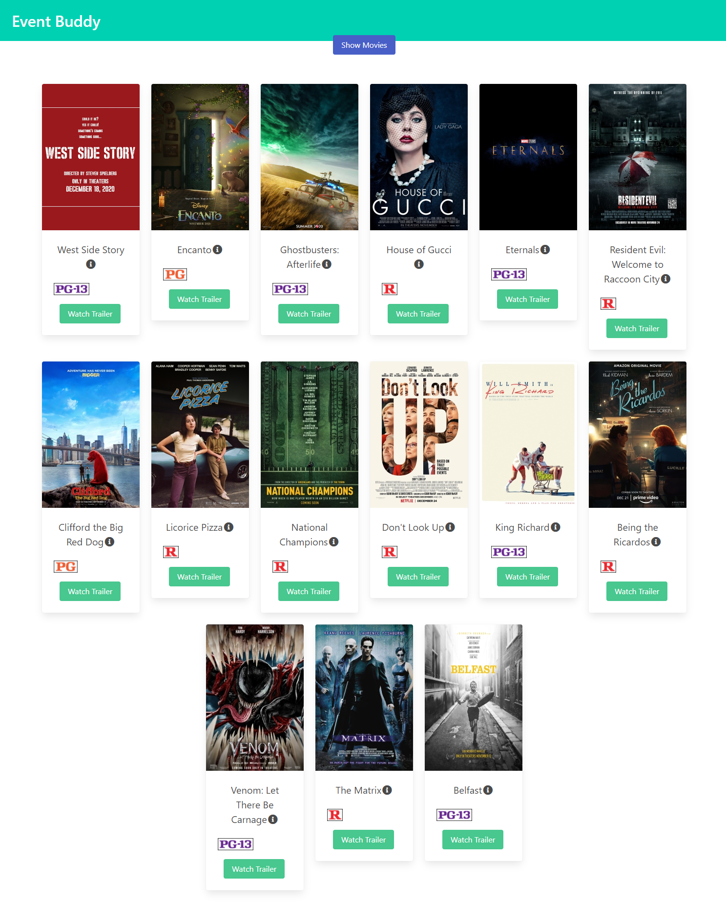
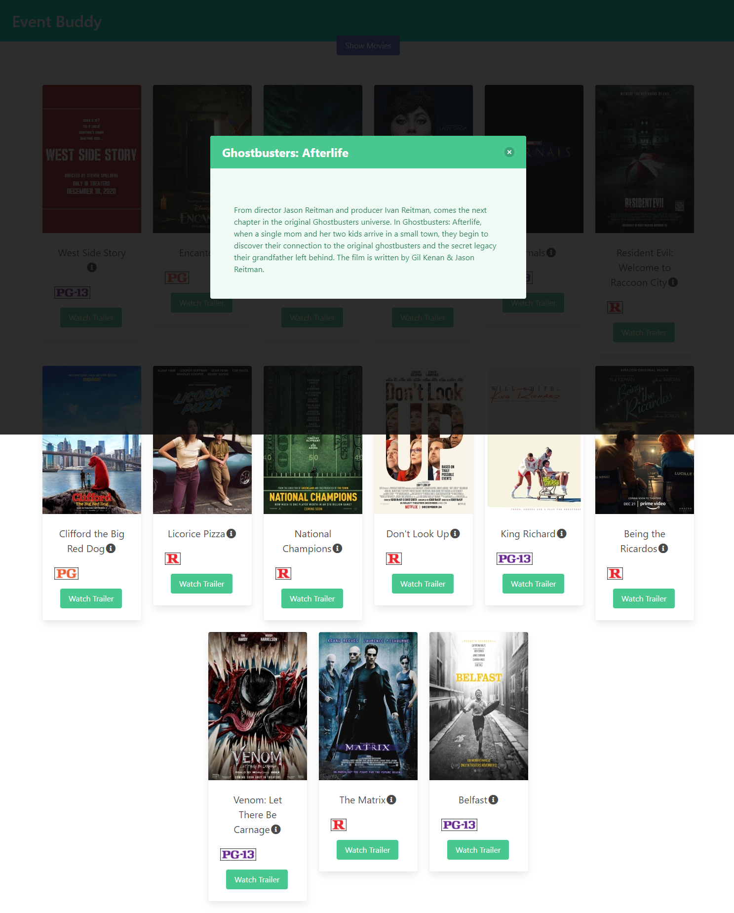
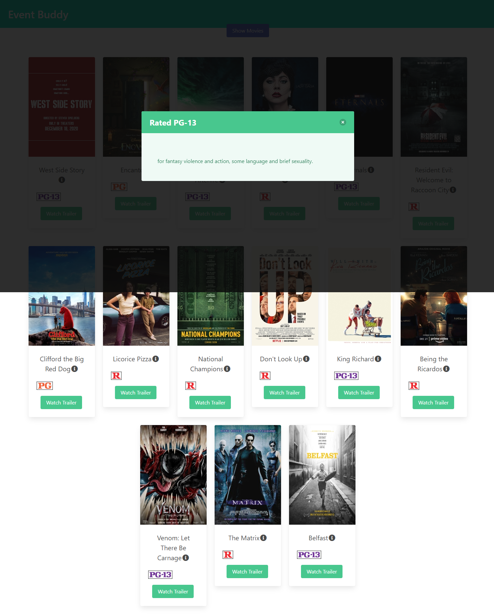
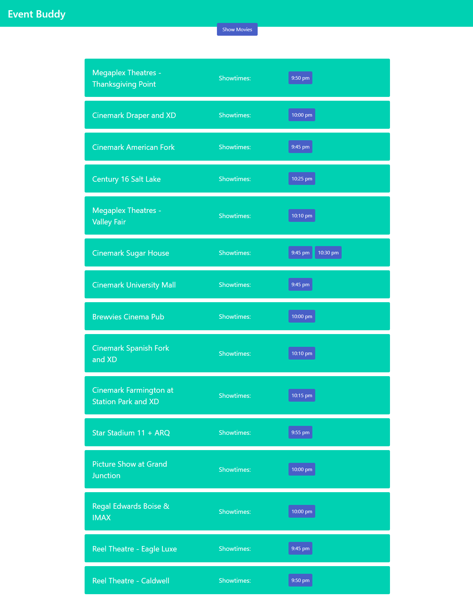
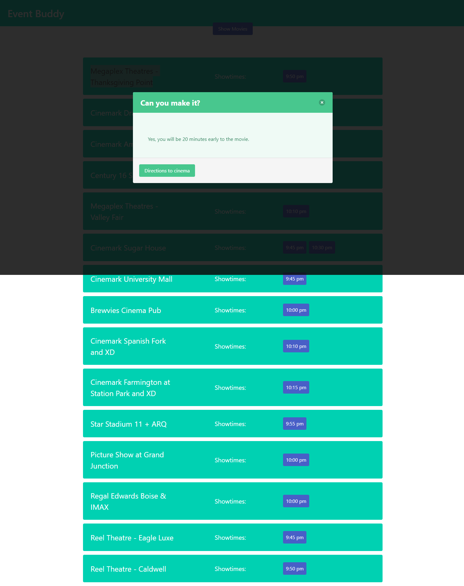

# Can We Make It?

## Story of app conception

We were first inspired for this idea for creating an app to find things to do while traveling in a place other than home to find things to do in a certain amout of time. We first tried to get setup with the Yelp api to gather location data of different points of interest near by. We found out that the Yelp api is hard to access and we gave up on that idea. We wanted to continue with our basic idea so we looked into using the Ticketmaster api to get event info. We built this app to get event info and check the driving time to see if you can get there on time but after we started testing we realized that there are not many events available to use this for same day events. We figured that movie showtimes would give us better data to work with but we had a hard time getting any showtimes api to work. 

So we continued with our Ticketmaster api just to have some type of app to work even if the data was not very good. John tried one last time to get one of the many showtimes api's (movieGlu) that he was tesing to work one late night and he noticed that the device time in the header was not correct and he fixed that and it then worked fine! 

We decided the next day as a group, with less than a week to go before presenting, to procede to convert our app to the movieGlu movies and showtimes api to check if you have enough time to get to a certain movie theater before a certain movie begins. We are much more happy with the data that we get from this api but we are limited to 75 total requests per api-key generated. Since you make at the minimum 2-3 requests per time you use this app, its not very sustainable. We hope that this app can spur ideas for other apps in the future.

## Description of functionality

This app requires very little input from the user. It first gets a list of movies currently playing in theaters in the US. It sorts it by the movies with the most amount of showtimes at the top. It will store this list in the localStorage and if you rerun this app and it has a list stored and it was stored the same day, then it will just use that list rather than running the api again. 

From this movies list you can see the movie poster, the title and the rating of each movie. You can click on the information icon next to the title of the movie to display a synopsis of that movie in a simple modal. You can also click on the rating image and read the reasoning for the rating for that specific movie in the same type of modal. You can also click on the "Watch Trailer" button below each movie to view the trailer for that movie in a seperate tab in the browser. 

To see the showtimes of a specific movie, you can click on the poster of that movie.

At this point, it gathers your current location, then runs the movieGlu api again to get showtimes around the lat&long location of your device. It sorts the data by putting the closest theater at the top and only displays showtimes that are in the future. 

You can then click on a specific showtime and it will first run the movieGlu api to get the long&lat location of that specific theater and then runs the MapBox api to get the driving time between your current location and the location of the theater. Then it calculates an arrival time and checks if that arrival time is before or after the showtime chosen. It will tell you how early or late you will be to the movie based on those variables. 

As a bonus feature, it also gives you a button to get the Google Maps driving directions from your current location to the theater and it opens that in a seperate tab. 

You can always exit a modal and click the Get Movies button to go back to the list of movies and maybe choose another movie.

## Installation

Follow the following link to load code into a browser.

[Can We Make it?](https://dcarteciano.github.io/travel-buddy/)

## Usage

Here are screenshots of the finished app:

